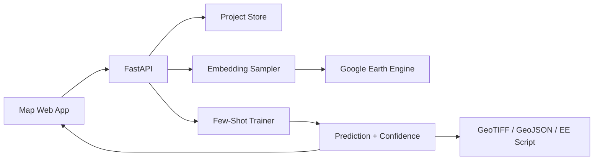

# System Design

## Goal

Build an accessible mapping system where users can create high-quality thematic maps from sparse examples by leveraging EO embeddings, starting with AlphaEarth Satellite Embeddings in Earth Engine.

## MVP Modules

### 1. Label Studio Map

The web app lets users create a project, choose year and area, define classes, add labeled points or polygons, and start a training run.

### 2. Embedding Sampler

The API receives geometries and queries the embedding source for all 64 bands:

```text
A00 ... A63
```

For the AlphaEarth source, vectors are unit-length and can be compared with dot product or cosine similarity.

### 3. Few-Shot Trainer

Initial algorithms:

- kNN for transparent similarity-based classification.
- Random Forest for robust tabular classification.
- LightGBM later for better tabular performance when available.

### 4. Confidence Layer

Initial confidence can be derived from:

- kNN neighbor agreement.
- Class probability from tree models.
- Distance to nearest labeled prototypes.
- Ensemble disagreement.

### 5. Active Learning

Recommend next labels from pixels or cells where:

- classifier confidence is low,
- embeddings are far from existing samples,
- classes overlap in embedding space,
- spatial coverage is poor.

### 6. Export

Target formats:

- GeoJSON for labels and vector predictions.
- Cloud Optimized GeoTIFF for raster predictions.
- Earth Engine script for reproducible server-side workflows.
- QGIS project later.

### 7. Raster Tile Layers

The MVP supports real Earth Engine map tiles:

- Sentinel-2 true-color imagery for visual context.
- AlphaEarth embedding RGB visualization.
- Continuous similarity layers from a clicked prototype point.
- Classification layers trained from user labels with Earth Engine Random Forest.

Grid endpoints remain useful as debug previews, but production UX should prefer tile layers and exports.

## Reference Architecture



## Deployment Shape

Early stage:

- Static frontend.
- FastAPI backend.
- Local files or SQLite for prototypes.

Production stage:

- React or similar frontend.
- FastAPI workers.
- PostGIS for projects and labels.
- Object storage for exports.
- Task queue for large inference jobs.
- Earth Engine service account or user OAuth.
